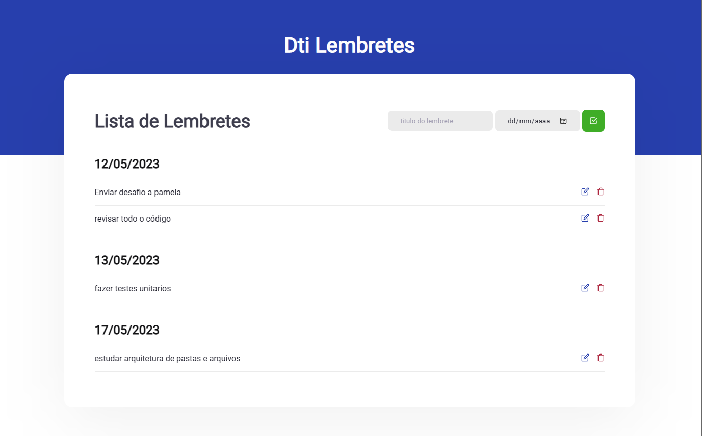

  

# Meus lembretes

Desafio prático da dti, para seleção de estágio, aplicação com frontend em react e backend em C# com dotnet core.

### Screenshots

## Premissa

Desenvolver um aplicativo completo com frontend e backend funcional, atendendo aos critérios do desáfio.

Onde o usuário pode adicionar lembretes permitindo além de escrever qualquer titulo, também selecionar qualquer data futura.

Além disso, também é possivél editar e excluir os lembretes.

## Como rodar a aplicação

1. baixe ou clone o projeto.
2. entre na pasta frontend, Instale as dependências usando o comando `npm install` ou `yarn`.
3. abra o backend com o visual studio, aguarde ele restaurar as dependências, após isso basta iniciar a aplicação normalmente.
4. voltando para a pasta frontend após instalar as dependências do passo 2, execute o comando `npm start` ou `yarn start`. o frontend vai abrir no endereço <http://localhost:3000>.
5. use o app a vontade.

## Tecnologias utilizadas

- ReactJS
- Scss
- Dotnet Core 5.0
- Entity Framework
- Sqlite
- Typescript
- C#

## Solução de problemas

- erro ao rodar o backend: provavélmente você não possui o sdk/runtime do dotnet 5, baixe <a href="https://dotnet.microsoft.com/pt-br/download/dotnet/5.0"> aqui neste link <a/>.
- erro ao rodar o frontend: por baixo dos panos o nodejs vai precisar do python baixa instalar ele da maneira que preferir, recomendo o chocolatey (digite `choco install python` no terminal/powershell) ou winget(digite `winget install --id 9P7QFQMJRFP7` no terminal/powershell).
- erro ao rodar o frontend: nem sempre o nodejs consegue compilar o scss recomendo usar a versão 14.16, baixe <a href="https://nodejs.org/dist/v14.16.0/node-v14.16.0-x64.msi"> aqui neste link <a/>.
